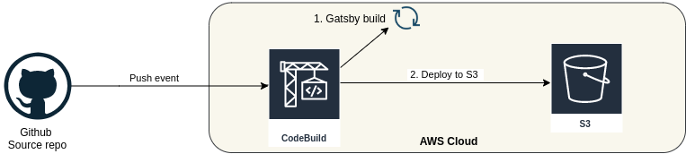

# MyApp: a front in Gatsby, hosted in AWS S3

## Overview
This setup will deploy a ReactJs gatsby website, hosted on AWS S3.
Codebuild will push new commit to S3 for CI/CD.

This website will connect to an API backend, deployed via this [code](https://github.com/gregbkr/myapp-serverless-api).

More info: you can find an overview of that setup on my [blog](https://greg.satoshi.tech/gatsby-s3)

### Infra


- Front: Reactjs [Gatsby](https://www.gatsbyjs.org) with [Gatsby starter template](https://www.gatsbyjs.org/starters/gatsbyjs/gatsby-starter-default/)
- Hosting: [S3](https://docs.aws.amazon.com/AmazonS3/latest/dev/Welcome.html)
- CDN: [cloudfront](https://aws.amazon.com/cloudfront)
- CI: Codebuild
- Deployment: [CloudFormation](https://aws.amazon.com/cloudformation) templates

### CI/CD flow diagram



A simple `git push` from a developer in Github will launch the whole CI/CD process. Codebuild will copy the change to S3 and changes will appear directly.

## Deploy

### Prerequisites
Please setup on your laptop:
- AWS cli, and AWS account to deploy in `eu-west-1`
- Github personal token with `admin:repo_hook, repo` rights from [here](https://github.com/settings/tokens)

### Setup API backend
- Go to repo [myapp-serverless-api](https://github.com/gregbkr/myapp-serverless-api) and deploy it
- Retrieve the `api url` and `api keys`
- Register both variables in SSM:
```
aws ssm put-parameter --name "/master/myapp/api_url" --value "<YOUR_API_URL>" --type String --overwrite
aws ssm put-parameter --name "/master/myapp/api_key" --value "<YOUR_API_KEY>" --type SecureString --overwrite

aws ssm put-parameter --name "/master/myapp/api_url" --value "hxaxon4jz9.execute-api.eu-west-1.amazonaws.com/Prod/" --type String --overwrite  <-- as an example
```
- Check with `aws ssm describe-parameters --filters "Key=Name,Values=/master/myapp"`
- `aws ssm get-parameter --name "/master/myapp/api_url" --with-decryption`


### Initialization
- Optional: create a certificate for this API e.g.: `*.myapp.cloudlabs.link`
- First create the infra (S3 bucket & Cloudfront & Codebuild):

```
cd cloudformation
export CF_DEMO_ENVIRONMENT=greg-gg

./deploy.sh \
    ${CF_DEMO_ENVIRONMENT} \
    https://github.com/gregbkr/myapp-front-api \
    21414af27e9f3f2eccaf68554459b5a8e1d17c5b \
    front.cloudlabs.link \
    ieddcaot8i.execute-api.eu-west-1.amazonaws.com/Prod/ \
    YetSxaQMZj7A4wLmV5Fd3aVQ3oXfilyL7dpV6k2m
```

- Browse the front url:
```
aws cloudformation \
   describe-stacks \
   --query 'Stacks[0].Outputs[?OutputKey==`WebsiteURL`].OutputValue' \
   --stack-name ${CF_DEMO_ENVIRONMENT}-front-infra
```


nano main.yml <-- edit with your needs
aws cloudformation create-stack --stack-name myapp-demo-front-infra-init --template-body file://main.yml --capabilities CAPABILITY_NAMED_IAM
... update-stack ... <-- if already created


## Deploy FRONT

### Deploy manually
- Follow code in buildspec.yml to deploy manually (or use local build, see in annexes).

### Deploy via CI
- Edit ci with your needs: `nano buildspec.yml`
- Push code to master or develop for auto CI/CD
- For local build, see in annexes.

### Check
- S3 [url](http://myapp.cloudlabs.link.s3-website-eu-west-1.amazonaws.com/)
- Domain [url](https://myapp.cloudllabs.link) via cloudfront + cert

## Destroy all
- Destroy using the right region: `aws cloudformation delete-stack --stack-name <YOUR_STACK_NAME> --region eu-west-1`

### Dev
- Run local gatsby: `gatsby develop` 
- Browser http://127.0.0.1:8000

## Annexes

### Local Codebuild: 
- Download + build docker [here](https://github.com/aws/aws-codebuild-docker-images/tree/master/ubuntu/standard/3.0)
- Download codebuild_build.sh [here](https://github.com/aws/aws-codebuild-docker-images/blob/master/local_builds/codebuild_build.sh)
- Edit `.env` to set the version to deploy [develop|master]
- Run local build: `./codebuild_build.sh -i aws/codebuild/standard:3.0 -a /tmp/artifacts -s . -e .env.production -c`

